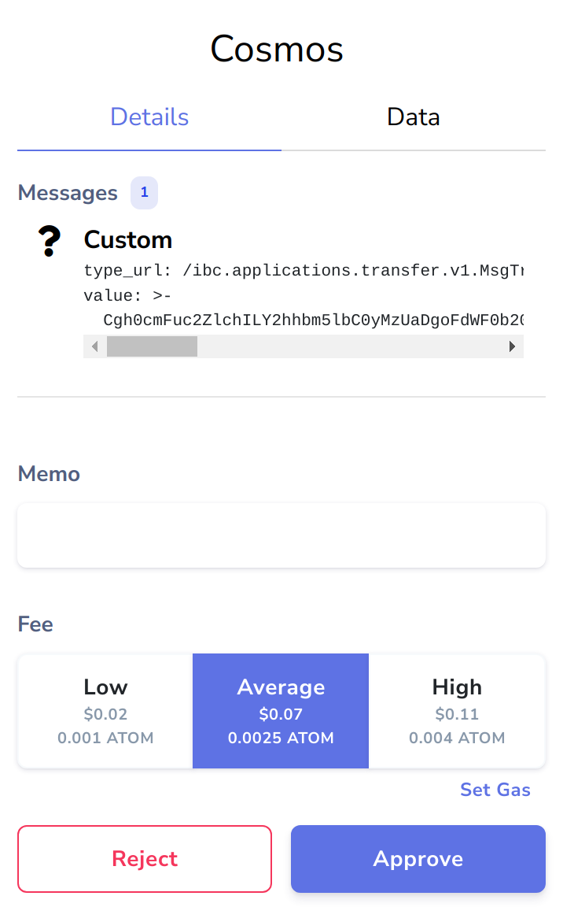

### Stateset Network Node.js Library

<p align="center">
  <a href="https://docs.stateset.io/stateset-docs/stateset-commerce-network-guides/chain-development/get-started" target="_blank"><strong>Explore the Docs »</strong></a>
</p>
<p align="center">
  <a href="https://github.com/stateset/stateset-js" target="_blank"><strong>GitHub</strong></a>
</p>

<h1 id="table-of-contents">Table of Contents</h1>

- [Key Features](#key-features)
- [Beta Version Notice](#beta-version-notice)
- [Installation](#installation)
- [Usage Examples](#usage-examples)
  - [Sending Queries](#sending-queries)
  - [Broadcasting Transactions](#broadcasting-transactions)
  - [Keplr Wallet](#keplr-wallet)
    - [`getOfflineSignerOnlyAmino()`](#getofflinesigneronlyamino)
    - [`getOfflineSigner()`](#getofflinesigner)
    - [`getOfflineSignerAuto()`](#getofflinesignerauto)
- [Migrating from Stateset.js v0.17.x](#migrating-from-statesetjs-v017x)
- [API](#api)
  - [Wallet](#wallet)
    - [Importing account from mnemonic](#importing-account-from-mnemonic)
    - [Generating a random account](#generating-a-random-account)
  - [StatesetNetworkClient](#statesetnetworkclient)
    - [Querier stateset.js](#querier-statesetjs)
    - [Signer stateset.js](#signer-statesetjs)
    - [`statesetjs.query`](#statesetjsquery)
    - [`statesetjs.address`](#statesetjsaddress)
    - [`statesetjs.tx`](#statesetjstx)

# Key Features

Stateset.js a JavaScript SDK for writing applications that interact with the Stateset Commerce Network blockchain.

- Written in TypeScript and provided with type definitions.
- Provides simple abstractions over core data structures.
- Supports every possible message and transaction type.
- Exposes every possible query type.
- Handles input/output encryption/decryption for Stateset Contracts.
- Works in Node.js, modern web browsers and React Native.

# Beta Version Notice

This library is still in beta, **APIs may break**. Beta testers are welcome!

See [project board](https://github.com/stateset/stateset.js/projects/1) for list of existing/missing features.

# Installation

```bash
npm install stateset-js@beta
```

or

```bash
yarn add stateset-js@beta
```

# Usage Examples

Note: Public gRPC-web endpoints can be found in https://github.com/stateset/api-registry for both mainnet and testnet.

For a lot more usage examples [refer to the tests](./test/test.ts).

## Sending Queries

```ts

import { StatesetNetworkClient, grpc } from "stateset-js";

const grpcWebUrl = "TODO get from https://github.com/stateset/api-registry";

// To create a readonly stateset.js client, just pass in a gRPC-web endpoint
const statesetjs = await StatesetNetworkClient.create({
  grpcWebUrl,
  chainId: "stateset-1-testnet",
});

const {
  balance: { amount },
} = await statesetjs.query.bank.balance(
  {
    address: "stateset1ap26qrlp8mcq2pg6r47w43l0y8zkqm8a450s03",
    denom: "ustate",
  } /*,
  // optional: query at a specific height (using an archive node) 
  new grpc.Metadata({"x-cosmos-block-height": "2000000"})
  */,
);

console.log(`I have ${Number(amount) / 1e6} STATE!`);

const sSTATE = "stateset1k0jntykt7e4g3y88ltc60czgjuqdy4c9e8fzek";
// Get codeHash using `statesetcli q compute contract-hash stateset1k0jntykt7e4g3y88ltc60czgjuqdy4c9e8fzek`
const sScrtCodeHash =
  "af74387e276be8874f07bec3a87023ee49b0e7ebe08178c49d0a49c3c98ed60e";

const { token_info } = await statesetjs.query.compute.queryContract({
  contractAddress: sSTATE,
  codeHash: sStateCodeHash, // optional but way faster
  query: { token_info: {} },
});

console.log(`sSTATE has ${token_info.decimals} decimals!`);
```

## Broadcasting Transactions

```ts
import { Wallet, StatesetNetworkClient, MsgSend, MsgMultiSend } from "statesetjs";

const wallet = new Wallet(
  "grant rice replace explain federal release fix clever romance raise often wild taxi quarter soccer fiber love must tape steak together observe swap guitar",
);
const myAddress = wallet.address;

const grpcWebUrl = "TODO get from https://github.com/stateset/api-registry";

// To create a signer stateset.js client, also pass in a wallet
const statesetjs = await StatesetNetworkClient.create({
  grpcWebUrl,
  chainId: "stateset-1-testnet",
  wallet: wallet,
  walletAddress: myAddress,
});

const bob = "stateset1dgqnta7fwjj6x9kusyz7n8vpl73l7wsm0gaamk";
const msg = new MsgSend({
  fromAddress: myAddress,
  toAddress: bob,
  amount: [{ denom: "ustate", amount: "1" }],
});

const tx = await statesetjs.tx.broadcast([msg], {
  gasLimit: 20_000,
  gasPriceInFeeDenom: 0.25,
  feeDenom: "ustate",
});
```

## Keplr Wallet

The recommended way to integrate Keplr is by using `window.keplr.getOfflineSignerOnlyAmino()`:

```ts
const sleep = (ms: number) => new Promise((resolve) => setTimeout(resolve, ms));

while (
  !window.keplr ||
  !window.getEnigmaUtils ||
  !window.getOfflineSignerOnlyAmino
) {
  await sleep(100);
}

const CHAIN_ID = "stateset-1-testnet";

await window.keplr.enable(CHAIN_ID);

const keplrOfflineSigner = window.getOfflineSignerOnlyAmino(CHAIN_ID);
const [{ address: myAddress }] = await keplrOfflineSigner.getAccounts();

const grpcWebUrl = "TODO get from https://github.com/stateset/api-registry";

const statesetjs = await StatesetNetworkClient.create({
  grpcWebUrl,
  chainId: CHAIN_ID,
  wallet: keplrOfflineSigner,
  walletAddress: myAddress,
  encryptionUtils: window.getEnigmaUtils(CHAIN_ID),
});

// Note: Using `window.getEnigmaUtils` is optional, it will allow
// Keplr to use the same encryption seed across sessions for the account.
// The benefit of this is that `statesetjs.query.getTx()` will be able to decrypt
// the response across sessions.
```

### `getOfflineSignerOnlyAmino()`

Although this is the legacy way of signing transactions on cosmos-sdk, it's still the most recommended for connecting to Keplr due to Ledger support & better UI on Keplr.

- 🟩 Looks good on Keplr
- 🟩 Supports users signing with Ledger
- 🟥 Doesn't support signing transactions with these Msgs:
  - [authz/MsgExec](https://statesetjs.stateset.network/classes/MsgExec)
  - [authz/MsgGrant](https://statesetjs.stateset.network/classes/MsgGrant)
  - [authz/MsgRevoke](https://statesetjs.stateset.network/classes/MsgRevoke)
  - [feegrant/MsgGrantAllowance](https://statesetjs.stateset.network/classes/MsgGrantAllowance)
  - [feegrant/MsgRevokeAllowance](https://statesetjs.stateset.network/classes/MsgRevokeAllowance)
  - All IBC relayer Msgs:
    - [gov/MsgSubmitProposal/ClientUpdateProposal](https://statesetjs.stateset.network/enums/ProposalType#ClientUpdateProposal)
    - [gov/MsgSubmitProposal/UpgradeProposal](https://statesetjs.stateset.network/enums/ProposalType#UpgradeProposal)
    - [ibc_channel/MsgAcknowledgement](https://statesetjs.stateset.network/classes/MsgAcknowledgement)
    - [ibc_channel/MsgChannelCloseConfirm](https://statesetjs.stateset.network/classes/MsgChannelCloseConfirm)
    - [ibc_channel/MsgChannelCloseInit](https://statesetjs.stateset.network/classes/MsgChannelCloseInit)
    - [ibc_channel/MsgChannelOpenAck](https://statesetjs.stateset.network/classes/MsgChannelOpenAck)
    - [ibc_channel/MsgChannelOpenConfirm](https://statesetjs.stateset.network/classes/MsgChannelOpenConfirm)
    - [ibc_channel/MsgChannelOpenInit](https://statesetjs.stateset.network/classes/MsgChannelOpenInit)
    - [ibc_channel/MsgChannelOpenTry](https://statesetjs.stateset.network/classes/MsgChannelOpenTry)
    - [ibc_channel/MsgRecvPacket](https://statesetjs.stateset.network/classes/MsgRecvPacket)
    - [ibc_channel/MsgTimeout](https://statesetjs.stateset.network/classes/MsgTimeout)
    - [ibc_channel/MsgTimeoutOnClose](https://statesetjs.stateset.network/classes/MsgTimeoutOnClose)
    - [ibc_client/MsgCreateClient](https://statesetjs.stateset.network/classes/MsgCreateClient)
    - [ibc_client/MsgSubmitMisbehaviour](https://statesetjs.stateset.network/classes/MsgSubmitMisbehaviour)
    - [ibc_client/MsgUpdateClient](https://statesetjs.stateset.network/classes/MsgUpdateClient)
    - [ibc_client/MsgUpgradeClient](https://statesetjs.stateset.network/classes/MsgUpgradeClient)
    - [ibc_connection/MsgConnectionOpenAck](https://statesetjs.stateset.network/classes/MsgConnectionOpenAck)
    - [ibc_connection/MsgConnectionOpenConfirm](https://statesetjs.stateset.network/classes/MsgConnectionOpenConfirm)
    - [ibc_connection/MsgConnectionOpenInit](https://statesetjs.stateset.network/classes/MsgConnectionOpenInit)
    - [ibc_connection/MsgConnectionOpenTry](https://statesetjs.stateset.network/classes/MsgConnectionOpenTry)

Note that [ibc_transfer/MsgTransfer](https://statesetjs.stateset.network/classes/MsgTransfer) for sending funds across IBC **is** supported.


### `getOfflineSigner()`

The new way of signing transactions on cosmos-sdk, it's more efficient but still doesn't have Ledger support, so it's most recommended for usage in apps that don't require signing transactions with Ledger.

- 🟥 Looks bad on Keplr
- 🟥 Doesn't support users signing with Ledger
- 🟩 Supports signing transactions with all types of Msgs



### `getOfflineSignerAuto()`

Currently this is equivalent to `keplr.getOfflineSigner()` but may change at the discretion of the Keplr team.

# Migrating from Stateset.js v0.17.x

- `v0.9.x` through `v0.16.x` supported `stateset-2` & `stateset-3`
- `v0.17.x` supports `stateset-4`
- `v1.2.x` supports `stateset-4`, corresponds to [`v1.2.x` of statesetd](https://github.com/stateset/StatesetNetwork/releases/tag/v1.2.0)

# API

## Wallet

An offline wallet implementation, used to sign transactions. Usually we'd just want to pass it to `StatesetNetworkClient`.

[**Full API »**](https://statesetjs.stateset.network/classes/Wallet.html)

### Importing account from mnemonic

```ts
import { Wallet } from "statesetjs";

const wallet = new Wallet(
  "grant rice replace explain federal release fix clever romance raise often wild taxi quarter soccer fiber love must tape steak together observe swap guitar",
);
const myAddress = wallet.address;
```

### Generating a random account

```ts
import { Wallet } from "statesetjs";

const wallet = new Wallet();
const myAddress = wallet.address;
const myMnemonicPhrase = wallet.mnemonic;
```

## StatesetNetworkClient

[**Full API »**](https://statesetjs.stateset.network/classes/StatesetNetworkClient.html)

### Querier stateset.js

A querier client can only send queries and get chain information. Access to all query types can be done via `statesetjs.query`.

```ts
import { StatesetNetworkClient } from "statesetjs";

const grpcWebUrl = "TODO get from https://github.com/stateset/api-registry";

// To create a readonly stateset.js client, just pass in a gRPC-web endpoint
const statesetjs = await StatesetNetworkClient.create({
  chainId: "stateset-1-testnet",
  grpcWebUrl,
});
```

### Signer stateset.js

A signer client can broadcast transactions, send queries and get chain information.

Here in addition to `statesetjs.query`, there are also `statesetjs.tx` & `statesetjs.address`.

```ts
import { Wallet, StatesetNetworkClient, MsgSend, MsgMultiSend } from "statesetjs";

const wallet = new Wallet(
  "grant rice replace explain federal release fix clever romance raise often wild taxi quarter soccer fiber love must tape steak together observe swap guitar",
);
const myAddress = wallet.address;

const grpcWebUrl = "TODO get from https://github.com/stateset/api-registry";

// To create a signer stateset.js client you must also pass in `wallet`, `walletAddress` and `chainId`
const statesetjs = await StatesetNetworkClient.create({
  grpcWebUrl,
  chainId: "stateset-1-network",
  wallet: wallet,
  walletAddress: myAddress,
});
```

### `statesetjs.query`

#### `statesetjs.query.getTx(hash)`

Returns a transaction with a txhash. `hash` is a 64 character upper-case hex string.

#### `statesetjs.query.txsQuery(query)`

Returns all transactions that match a query.

To tell which events you want, you need to provide a query. query is a string, which has a form: `condition AND condition ...` (no OR at the moment). Condition has a form: `key operation operand`. key is a string with a restricted set of possible symbols (`\t`, `\n`, `\r`, `\`, `(`, `)`, `"`, `'`, `=`, `>`, `<` are not allowed). Operation can be `=`, `<`, `<=`, `>`, `>=`, `CONTAINS` AND `EXISTS`. Operand can be a string (escaped with single quotes), number, date or time.

Examples:

- `tx.hash = 'XYZ'` # single transaction
- `tx.height = 5` # all txs of the fifth block
- `create_validator.validator = 'ABC'` # tx where validator ABC was created

Tendermint provides a few predefined keys: `tx.hash` and `tx.height`. You can provide additional event keys that were emitted during the transaction. All events are indexed by a composite key of the form `{eventType}.{evenAttrKey}`. Multiple event types with duplicate keys are allowed and are meant to categorize unique and distinct events.

To create a query for txs where AddrA transferred funds: `transfer.sender = 'AddrA'`

See `txsQuery` under https://statesetjs.stateset.network/modules#Querier.

#### `statesetjs.query.auth.account()`

Returns account details based on address.

```ts
const { address, accountNumber, sequence } = await statesetjs.query.auth.account({
  address: myAddress,
});
```

#### `statesetjs.query.auth.accounts()`

Returns all existing accounts on the blockchain.

```ts
/// Get all accounts
const result = await statesetjs.query.auth.accounts({});
```

#### `statesetjs.query.auth.params()`

Queries all x/auth parameters.

```ts
const {
  params: {
    maxMemoCharacters,
    sigVerifyCostEd25519,
    sigVerifyCostSecp256k1,
    txSigLimit,
    txSizeCostPerByte,
  },
} = await statesetjs.query.auth.params();
```

#### `statesetjs.query.authz.grants()`

Returns list of authorizations, granted to the grantee by the granter.

#### `statesetjs.query.bank.balance()`

Balance queries the balance of a single coin for a single account.

```ts
const { balance } = await statesetjs.query.bank.balance({
  address: myAddress,
  denom: "ustate",
});
```

#### `statesetjs.query.bank.allBalances()`

AllBalances queries the balance of all coins for a single account.

#### `statesetjs.query.bank.totalSupply()`

TotalSupply queries the total supply of all coins.

#### `statesetjs.query.bank.supplyOf()`

SupplyOf queries the supply of a single coin.

#### `statesetjs.query.bank.params()`

Params queries the parameters of x/bank module.

#### `statesetjs.query.bank.denomMetadata()`

DenomsMetadata queries the client metadata of a given coin denomination.

#### `statesetjs.query.bank.denomsMetadata()`

DenomsMetadata queries the client metadata for all registered coin denominations.

#### `statesetjs.query.compute.contractCodeHash()`

Get codeHash of a Stateset Contract.

#### `statesetjs.query.compute.codeHash()`

Get codeHash from a code id.

#### `statesetjs.query.compute.contractInfo()`

Get metadata of a Stateset Contract.

#### `statesetjs.query.compute.contractsByCode()`

Get all contracts that were instantiated from a code id.

#### `statesetjs.query.compute.queryContract()`

Query a Stateset Contract.

```ts
type Result = {
  token_info: {
    decimals: number;
    name: string;
    symbol: string;
    total_supply: string;
  };
};

const result = (await statesetjs.query.compute.queryContract({
  contractAddress: sScrtAddress,
  codeHash: sScrtCodeHash, // optional but way faster
  query: { token_info: {} },
})) as Result;
```

#### `statesetjs.query.compute.code()`

Get WASM bytecode and metadata for a code id.

```ts
const { codeInfo } = await statesetjs.query.compute.code(codeId);
```

#### `statesetjs.query.compute.codes()`

Query all contract codes on-chain.

#### `statesetjs.query.distribution.params()`

Params queries params of the distribution module.

#### `statesetjs.query.distribution.validatorOutstandingRewards()`

ValidatorOutstandingRewards queries rewards of a validator address.

#### `statesetjs.query.distribution.validatorCommission()`

ValidatorCommission queries accumulated commission for a validator.

#### `statesetjs.query.distribution.validatorSlashes()`

ValidatorSlashes queries slash events of a validator.

#### `statesetjs.query.distribution.delegationRewards()`

DelegationRewards queries the total rewards accrued by a delegation.

#### `statesetjs.query.distribution.delegationTotalRewards()`

DelegationTotalRewards queries the total rewards accrued by a each validator.

#### `statesetjs.query.distribution.delegatorValidators()`

DelegatorValidators queries the validators of a delegator.

#### `statesetjs.query.distribution.delegatorWithdrawAddress()`

DelegatorWithdrawAddress queries withdraw address of a delegator.

#### `statesetjs.query.distribution.communityPool()`

CommunityPool queries the community pool coins.

#### `statesetjs.query.distribution.foundationTax()`

DelegatorWithdrawAddress queries withdraw address of a delegator.

#### `statesetjs.query.evidence.evidence()`

Evidence queries evidence based on evidence hash.

#### `statesetjs.query.evidence.allEvidence()`

AllEvidence queries all evidence.

#### `statesetjs.query.feegrant.allowance()`

Allowance returns fee granted to the grantee by the granter.

#### `statesetjs.query.feegrant.allowances()`

Allowances returns all the grants for address.

#### `statesetjs.query.gov.proposal()`

Proposal queries proposal details based on ProposalID.

#### `statesetjs.query.gov.proposals()`

Proposals queries all proposals based on given status.

```ts
// Get all proposals
const { proposals } = await statesetjs.query.gov.proposals({
  proposalStatus: ProposalStatus.PROPOSAL_STATUS_UNSPECIFIED,
  voter: "",
  depositor: "",
});
```

#### `statesetjs.query.gov.vote()`

Vote queries voted information based on proposalID, voterAddr.

#### `statesetjs.query.gov.votes()`

Votes queries votes of a given proposal.

#### `statesetjs.query.gov.params()`

Params queries all parameters of the gov module.

#### `statesetjs.query.gov.deposit()`

Deposit queries single deposit information based proposalID, depositAddr.

```ts
const {
  deposit: { amount },
} = await statesetjs.query.gov.deposit({
  depositor: myAddress,
  proposalId: propId,
});
```

#### `statesetjs.query.gov.deposits()`

Deposits queries all deposits of a single proposal.

#### `statesetjs.query.gov.tallyResult()`

TallyResult queries the tally of a proposal vote.

#### `statesetjs.query.ibc_channel.channel()`

Channel queries an IBC Channel.

#### `statesetjs.query.ibc_channel.channels()`

Channels queries all the IBC channels of a chain.

#### `statesetjs.query.ibc_channel.connectionChannels()`

ConnectionChannels queries all the channels associated with a connection end.

#### `statesetjs.query.ibc_channel.channelClientState()`

ChannelClientState queries for the client state for the channel associated with the provided channel identifiers.

#### `statesetjs.query.ibc_channel.channelConsensusState()`

ChannelConsensusState queries for the consensus state for the channel associated with the provided channel identifiers.

#### `statesetjs.query.ibc_channel.packetCommitment()`

PacketCommitment queries a stored packet commitment hash.

#### `statesetjs.query.ibc_channel.packetCommitments()`

PacketCommitments returns all the packet commitments hashes associated with a channel.

#### `statesetjs.query.ibc_channel.packetReceipt()`

PacketReceipt queries if a given packet sequence has been received on the queried chain

#### `statesetjs.query.ibc_channel.packetAcknowledgement()`

PacketAcknowledgement queries a stored packet acknowledgement hash.

#### `statesetjs.query.ibc_channel.packetAcknowledgements()`

PacketAcknowledgements returns all the packet acknowledgements associated with a channel.

#### `statesetjs.query.ibc_channel.unreceivedPackets()`

UnreceivedPackets returns all the unreceived IBC packets associated with a channel and sequences.

#### `statesetjs.query.ibc_channel.unreceivedAcks()`

UnreceivedAcks returns all the unreceived IBC acknowledgements associated with a channel and sequences.

#### `statesetjs.query.ibc_channel.nextSequenceReceive()`

NextSequenceReceive returns the next receive sequence for a given channel.

#### `statesetjs.query.ibc_client.clientState()`

ClientState queries an IBC light client.

#### `statesetjs.query.ibc_client.clientStates()`

ClientStates queries all the IBC light clients of a chain.

#### `statesetjs.query.ibc_client.consensusState()`

ConsensusState queries a consensus state associated with a client state at a given height.

#### `statesetjs.query.ibc_client.consensusStates()`

ConsensusStates queries all the consensus state associated with a given client.

#### `statesetjs.query.ibc_client.clientStatus()`

Status queries the status of an IBC client.

#### `statesetjs.query.ibc_client.clientParams()`

ClientParams queries all parameters of the ibc client.

#### `statesetjs.query.ibc_client.upgradedClientState()`

UpgradedClientState queries an Upgraded IBC light client.

#### `statesetjs.query.ibc_client.upgradedConsensusState()`

UpgradedConsensusState queries an Upgraded IBC consensus state.

#### `statesetjs.query.ibc_connection.connection()`

Connection queries an IBC connection end.

#### `statesetjs.query.ibc_connection.connections()`

Connections queries all the IBC connections of a chain.

#### `statesetjs.query.ibc_connection.clientConnections()`

ClientConnections queries the connection paths associated with a client state.

#### `statesetjs.query.ibc_connection.connectionClientState()`

ConnectionClientState queries the client state associated with the connection.

#### `statesetjs.query.ibc_connection.connectionConsensusState()`

ConnectionConsensusState queries the consensus state associated with the connection.

#### `statesetjs.query.ibc_transfer.denomTrace()`

DenomTrace queries a denomination trace information.

#### `statesetjs.query.ibc_transfer.denomTraces()`

DenomTraces queries all denomination traces.

#### `statesetjs.query.ibc_transfer.params()`

Params queries all parameters of the ibc-transfer module.

#### `statesetjs.query.mint.params()`

Params returns the total set of minting parameters.

#### `statesetjs.query.mint.inflation()`

Inflation returns the current minting inflation value.

#### `statesetjs.query.mint.annualProvisions()`

AnnualProvisions current minting annual provisions value.

#### `statesetjs.query.params.params()`

Params queries a specific parameter of a module, given its subspace and key.

#### `statesetjs.query.registration.txKey()`

Returns the key used for transactions.

#### `statesetjs.query.registration.registrationKey()`

Returns the key used for registration.

#### `statesetjs.query.registration.encryptedSeed()`

Returns the encrypted seed for a registered node by public key.

#### `statesetjs.query.slashing.params()`

Params queries the parameters of slashing module.

#### `statesetjs.query.slashing.signingInfo()`

SigningInfo queries the signing info of given cons address.

#### `statesetjs.query.slashing.signingInfos()`

SigningInfos queries signing info of all validators.

#### `statesetjs.query.staking.validators()`

Validators queries all validators that match the given status.

```ts
// Get all validators
const { validators } = await statesetjs.query.staking.validators({ status: "" });
```

#### `statesetjs.query.staking.validator()`

Validator queries validator info for given validator address.

#### `statesetjs.query.staking.validatorDelegations()`

ValidatorDelegations queries delegate info for given validator.

#### `statesetjs.query.staking.validatorUnbondingDelegations()`

ValidatorUnbondingDelegations queries unbonding delegations of a validator.

#### `statesetjs.query.staking.delegation()`

Delegation queries delegate info for given validator delegator pair.

#### `statesetjs.query.staking.unbondingDelegation()`

UnbondingDelegation queries unbonding info for given validator delegator pair.

#### `statesetjs.query.staking.delegatorDelegations()`

DelegatorDelegations queries all delegations of a given delegator address.

#### `statesetjs.query.staking.delegatorUnbondingDelegations()`

DelegatorUnbondingDelegations queries all unbonding delegations of a given delegator address.

#### `statesetjs.query.staking.redelegations()`

Redelegations queries redelegations of given address.

#### `statesetjs.query.staking.delegatorValidators()`

DelegatorValidators queries all validators info for given delegator address.

#### `statesetjs.query.staking.delegatorValidator()`

DelegatorValidator queries validator info for given delegator validator pair.

#### `statesetjs.query.staking.historicalInfo()`

HistoricalInfo queries the historical info for given height.

#### `statesetjs.query.staking.pool()`

Pool queries the pool info.

#### `statesetjs.query.staking.params()`

Parameters queries the staking parameters.

#### `statesetjs.query.tendermint.getNodeInfo()`

GetNodeInfo queries the current node info.

#### `statesetjs.query.tendermint.getSyncing()`

GetSyncing queries node syncing.

#### `statesetjs.query.tendermint.getLatestBlock()`

GetLatestBlock returns the latest block.

#### `statesetjs.query.tendermint.getBlockByHeight()`

GetBlockByHeight queries block for given height.

#### `statesetjs.query.tendermint.getLatestValidatorSet()`

GetLatestValidatorSet queries latest validator-set.

#### `statesetjs.query.tendermint.getValidatorSetByHeight()`

GetValidatorSetByHeight queries validator-set at a given height.

#### `statesetjs.query.upgrade.currentPlan()`

CurrentPlan queries the current upgrade plan.

#### `statesetjs.query.upgrade.appliedPlan()`

AppliedPlan queries a previously applied upgrade plan by its name.

#### `statesetjs.query.upgrade.upgradedConsensusState()`

UpgradedConsensusState queries the consensus state that will serve as a trusted kernel for the next version of this chain. It will only be stored at the last height of this chain.

#### `statesetjs.query.upgrade.moduleVersions()`

ModuleVersions queries the list of module versions from state.

### `statesetjs.address`

On a signer stateset.js, `statesetjs.address` is the same as `walletAddress`:

```ts
import { Wallet, StatesetNetworkClient } from "statesetjs";

const wallet = new Wallet(
  "grant rice replace explain federal release fix clever romance raise often wild taxi quarter soccer fiber love must tape steak together observe swap guitar",
);
const myAddress = wallet.address;

const grpcWebUrl = "TODO get from https://github.com/stateset/api-registry";

// To create a signer stateset.js client, also pass in a wallet
const statesetjs = await StatesetNetworkClient.create({
  grpcWebUrl,
  chainId: "stateset-4",
  wallet: wallet,
  walletAddress: myAddress,
});

const alsoMyAddress = statesetjs.address;
```

### `statesetjs.tx`

On a signer stateset.js, `statesetjs.tx` is used to broadcast transactions. Every function under `statesetjs.tx` can receive an optional [TxOptions](https://statesetjs.stateset.network/modules#TxOptions).

[**Full API »**](https://statesetjs.stateset.network/modules#TxSender)

#### `statesetjs.tx.broadcast()`

Used to send a complex transactions, which contains a list of messages. The messages are executed in sequence, and the transaction succeeds if all messages succeed.

For a list of all messages see: https://statesetjs.stateset.network/interfaces/Msg

```ts
const addMinterMsg = new MsgExecuteContract({
  sender: MY_ADDRESS,
  contractAddress: MY_NFT_CONTRACT,
  codeHash: MY_NFT_CONTRACT_CODE_HASH, // optional but way faster
  msg: { add_minters: { minters: [MY_ADDRESS] } },
  sentFunds: [], // optional
});

const mintMsg = new MsgExecuteContract({
  sender: MY_ADDRESS,
  contractAddress: MY_NFT_CONTRACT,
  codeHash: MY_NFT_CONTRACT_CODE_HASH, // optional but way faster
  msg: {
    mint_nft: {
      token_id: "1",
      owner: MY_ADDRESS,
      public_metadata: {
        extension: {
          image: "https://stateset.network/statesetnetwork-logo-secondary-black.png",
          name: "statesetnetwork-logo-secondary-black",
        },
      },
      private_metadata: {
        extension: {
          image: "https://stateset.network/statesetnetwork-logo-primary-white.png",
          name: "statesetnetwork-logo-primary-white",
        },
      },
    },
  },
  sentFunds: [], // optional
});

const tx = await statesetjs.tx.broadcast([addMinterMsg, mintMsg], {
  gasLimit: 200_000,
});
```

#### `statesetjs.tx.simulate()`

Used to simulate a complex transactions, which contains a list of messages, without broadcasting it to the chain. Can be used to get a gas estimation or to see the output without actually committing a transaction on-chain.

The input should be exactly how you'd use it in `statesetjs.tx.broadcast()`, except that you don't have to pass in `gasLimit`, `gasPriceInFeeDenom` & `feeDenom`.

Notes:

- :warning: On mainnet it's recommended to not simulate every transaction as this can burden your node provider. Instead, use this while testing to determine the gas limit for each of your app's transactions, then in production use hard-coded values.
- Gas estimation is known to be a bit off, so you might need to adjust it a bit before broadcasting.

```ts
const sendToAlice = new MsgSend({
  fromAddress: bob,
  toAddress: alice,
  amount: [{ denom: "ustate", amount: "1" }],
});

const sendToEve = new MsgSend({
  fromAddress: bob,
  toAddress: eve,
  amount: [{ denom: "ustate", amount: "1" }],
});

const sim = await statesetjs.tx.simulate([sendToAlice, sendToEve]);

const tx = await statesetjs.tx.broadcast([sendToAlice, sendToEve], {
  // Adjust gasLimit up by 10% to account for gas estimation error
  gasLimit: Math.ceil(sim.gasInfo.gasUsed * 1.1),
});
```

#### `statesetjs.tx.authz.exec()`

MsgExec attempts to execute the provided messages using authorizations granted to the grantee. Each message should have only one signer corresponding to the granter of the authorization.

Input: [MsgExecParams](https://statesetjs.stateset.network/interfaces/MsgExecParams)

##### `statesetjs.tx.authz.exec.simulate()`

Simulates execution without sending a transactions. Input is exactly like the parent function. For more info see [`statesetjs.tx.simulate()`](#statesetjstxsimulate).

#### `statesetjs.tx.authz.grant()`

MsgGrant is a request type for Grant method. It declares authorization to the grantee on behalf of the granter with the provided expiration time.

Input: [MsgGrantParams](https://statesetjs.stateset.network/interfaces/MsgGrantParams)

##### `statesetjs.tx.authz.grant.simulate()`

Simulates execution without sending a transactions. Input is exactly like the parent function. For more info see [`statesetjs.tx.simulate()`](#statesetjstxsimulate).

#### `statesetjs.tx.authz.revoke()`

MsgRevoke revokes any authorization with the provided sdk.Msg type on the granter's account with that has been granted to the grantee.

Input: [MsgRevokeParams](https://statesetjs.stateset.network/interfaces/MsgRevokeParams)

##### `statesetjs.tx.authz.revoke.simulate()`

Simulates execution without sending a transactions. Input is exactly like the parent function. For more info see [`statesetjs.tx.simulate()`](#statesetjstxsimulate).

#### `statesetjs.tx.bank.multiSend()`

MsgMultiSend represents an arbitrary multi-in, multi-out send message.

Input: [MsgMultiSendParams](https://statesetjs.stateset.network/interfaces/MsgMultiSendParams)

```ts
const tx = await statesetjs.tx.bank.multiSend(
  {
    inputs: [
      {
        address: myAddress,
        coins: [{ denom: "ustate", amount: "2" }],
      },
    ],
    outputs: [
      {
        address: alice,
        coins: [{ denom: "ustate", amount: "1" }],
      },
      {
        address: bob,
        coins: [{ denom: "ustate", amount: "1" }],
      },
    ],
  },
  {
    gasLimit: 20_000,
  },
);
```

    ##### `statesetjs.tx.bank.multiSend.simulate()`

Simulates execution without sending a transactions. Input is exactly like the parent function. For more info see [`statesetjs.tx.simulate()`](#statesetjstxsimulate).

#### `statesetjs.tx.bank.send()`

MsgSend represents a message to send coins from one account to another.

Input: [MsgSendParams](https://statesetjs.state.network/interfaces/MsgSendParams)

```ts
const tx = await statesetjs.tx.bank.send(
  {
    fromAddress: myAddress,
    toAddress: alice,
    amount: [{ denom: "ustate", amount: "1" }],
  },
  {
    gasLimit: 20_000,
  },
);
```

##### `statesetjs.tx.bank.send.simulate()`

Simulates execution without sending a transactions. Input is exactly like the parent function. For more info see [`statesetjs.tx.simulate()`](#statesetjstxsimulate).

#### `statesetjs.tx.compute.storeCode()`

Upload a compiled contract to Stateset Network

Input: [MsgStoreCodeParams](https://statesetjs.state.network/interfaces/MsgStoreCodeParams)

```ts
const tx = await statesetjs.tx.compute.storeCode(
  {
    sender: myAddress,
    wasmByteCode: fs.readFileSync(
      `${__dirname}/snip20-ibc.wasm.gz`,
    ) as Uint8Array,
    source: "",
    builder: "",
  },
  {
    gasLimit: 1_000_000,
  },
);

const codeId = Number(
  tx.arrayLog.find((log) => log.type === "message" && log.key === "code_id")
    .value,
);
```

##### `statesetjs.tx.compute.storeCode.simulate()`

Simulates execution without sending a transactions. Input is exactly like the parent function. For more info see [`statesetjs.tx.simulate()`](#statesetjstxsimulate).

#### `statesetjs.tx.compute.instantiateContract()`

Instantiate a contract from code id

Input: [MsgInstantiateContractParams](https://statesetjs.state.network/interfaces/MsgInstanti

ateContractParams)

```ts
const tx = await statesetjs.tx.compute.instantiateContract(
  {
    sender: myAddress,
    codeId: codeId,
    codeHash: codeHash, // optional but way faster
    initMsg: {
      name: "Stateset STATE",
      admin: myAddress,
      symbol: "SSTATE",
      decimals: 6,
      initial_balances: [{ address: myAddress, amount: "1" }],
      prng_seed: "eW8=",
      config: {
        public_total_supply: true,
        enable_deposit: true,
        enable_redeem: true,
        enable_mint: false,
        enable_burn: false,
      },
      supported_denoms: ["ustate"],
    },
    label: "sSTATE",
    initFunds: [], // optional
  },
  {
    gasLimit: 100_000,
  },
);

const contractAddress = tx.arrayLog.find(
  (log) => log.type === "message" && log.key === "contract_address",
).value;
```

##### `statesetjs.tx.compute.instantiateContract.simulate()`

Simulates execution without sending a transactions. Input is exactly like the parent function. For more info see [`statesetjs.tx.simulate()`](#statesetjstxsimulate).

#### `statesetjs.tx.compute.executeContract()`

Execute a function on a contract

Input: [MsgExecuteContractParams](https://statesetjs.stateset.network/interfaces/MsgExecuteContractParams)

```ts
const tx = await statesetjs.tx.compute.executeContract(
  {
    sender: myAddress,
    contractAddress: contractAddress,
    codeHash: codeHash, // optional but way faster
    msg: {
      transfer: {
        recipient: bob,
        amount: "1",
      },
    },
    sentFunds: [], // optional
  },
  {
    gasLimit: 100_000,
  },
);
```

##### `statesetjs.tx.compute.executeContract.simulate()`

Simulates execution without sending a transactions. Input is exactly like the parent function. For more info see [`statesetjs.tx.simulate()`](#statesetjstxsimulate).

#### `statesetjs.tx.crisis.verifyInvariant()`

MsgVerifyInvariant represents a message to verify a particular invariance.

Input: [MsgVerifyInvariantParams](https://statesetjs.stateset.network/interfaces/MsgVerifyInvariantParams)

##### `statesetjs.tx.crisis.verifyInvariant.simulate()`

Simulates execution without sending a transactions. Input is exactly like the parent function. For more info see [`statesetjs.tx.simulate()`](#statesetjstxsimulate).

#### `statesetjs.tx.distribution.fundCommunityPool()`

MsgFundCommunityPool allows an account to directly fund the community pool.

Input: [MsgFundCommunityPoolParams](https://statesetjs.stateset.network/interfaces/MsgFundCommunityPoolParams)

```ts
const tx = await statesetjs.tx.distribution.fundCommunityPool(
  {
    depositor: myAddress,
    amount: [{ amount: "1", denom: "ustate" }],
  },
  {
    gasLimit: 20_000,
  },
);
```

##### `statesetjs.tx.distribution.fundCommunityPool.simulate()`

Simulates execution without sending a transactions. Input is exactly like the parent function. For more info see [`statesetjs.tx.simulate()`](#statesetjstxsimulate).

#### `statesetjs.tx.distribution.setWithdrawAddress()`

MsgSetWithdrawAddress sets the withdraw address for a delegator (or validator self-delegation).

Input: [MsgSetWithdrawAddressParams](https://statesetjs.stateset.network/interfaces/MsgSetWithdrawAddressParams)

```ts
const tx = await statesetjs.tx.distribution.setWithdrawAddress(
  {
    delegatorAddress: mySelfDelegatorAddress,
    withdrawAddress: myOtherAddress,
  },
  {
    gasLimit: 20_000,
  },
);
```

##### `statesetjs.tx.distribution.setWithdrawAddress.simulate()`

Simulates execution without sending a transactions. Input is exactly like the parent function. For more info see [`statesetjs.tx.simulate()`](#statesetjstxsimulate).

#### `statesetjs.tx.distribution.withdrawDelegatorReward()`

MsgWithdrawDelegatorReward represents delegation withdrawal to a delegator from a single validator.

Input: [MsgWithdrawDelegatorRewardParams](https://statesetjs.stateset.network/interfaces/MsgWithdraw

DelegatorRewardParams)

```ts
const tx = await statesetjs.tx.distribution.withdrawDelegatorReward(
  {
    delegatorAddress: myAddress,
    validatorAddress: someValidatorAddress,
  },
  {
    gasLimit: 20_000,
  },
);
```

##### `statesetjs.tx.distribution.withdrawDelegatorReward.simulate()`

Simulates execution without sending a transactions. Input is exactly like the parent function. For more info see [`statesetjs.tx.simulate()`](#statesetjstxsimulate).

#### `statesetjs.tx.distribution.withdrawValidatorCommission()`

MsgWithdrawValidatorCommission withdraws the full commission to the validator address.

Input: [MsgWithdrawValidatorCommissionParams](https://statesetjs.stateset.network/interfaces/MsgWithdraw

ValidatorCommissionParams)

```ts
const tx = await statesetjs.tx.distribution.withdrawValidatorCommission(
  {
    validatorAddress: myValidatorAddress,
  },
  {
    gasLimit: 20_000,
  },
);
```

Or a better one:

```ts
const tx = await statesetjs.tx.broadcast(
  [
    new MsgWithdrawDelegatorReward({
      delegatorAddress: mySelfDelegatorAddress,
      validatorAddress: myValidatorAddress,
    }),
    new MsgWithdrawValidatorCommission({
      validatorAddress: myValidatorAddress,
    }),
  ],
  {
    gasLimit: 30_000,
  },
);
```

##### `statesetjs.tx.distribution.withdrawValidatorCommission.simulate()`

Simulates execution without sending a transactions. Input is exactly like the parent function. For more info see [`statesetjs.tx.simulate()`](#statesetjstxsimulate).

#### `statesetjs.tx.evidence.submitEvidence()`

MsgSubmitEvidence represents a message that supports submitting arbitrary evidence of misbehavior such as equivocation or counterfactual signing.

Input: [MsgSubmitEvidenceParams](https://statesetjs.stateset.network/interfaces/MsgSubmitEvidenceParams)

##### `statesetjs.tx.evidence.submitEvidence.simulate()`

Simulates execution without sending a transactions. Input is exactly like the parent function. For more info see [`statesetjs.tx.simulate()`](#statesetjstxsimulate).

#### `statesetjs.tx.feegrant.grantAllowance()`

MsgGrantAllowance adds permission for Grantee to spend up to Allowance of fees from the account of Granter.

Input: [MsgGrantAllowanceParams](https://statesetjs.stateset.network/interfaces/MsgGrantAllowanceParams)

##### `statesetjs.tx.feegrant.grantAllowance.simulate()`

Simulates execution without sending a transactions. Input is exactly like the parent function. For more info see [`statesetjs.tx.simulate()`](#statesetjstxsimulate).

#### `statesetjs.tx.feegrant.revokeAllowance()`

MsgRevokeAllowance removes any existing Allowance from Granter to Grantee.

Input: [MsgRevokeAllowanceParams](https://statesetjs.stateset.network/interfaces/MsgRevokeAllowanceParams)

##### `statesetjs.tx.feegrant.revokeAllowance.simulate()`

Simulates execution without sending a transactions. Input is exactly like the parent function. For more info see [`statesetjs.tx.simulate()`](#statesetjstxsimulate).

#### `statesetjs.tx.gov.deposit()`

MsgDeposit defines a message to submit a deposit to an existing proposal.

Input: [MsgDepositParams](https://statesetjs.stateset.network/interfaces/MsgDepositParams)

```ts
const tx = await statesetjs.tx.gov.deposit(
  {
    depositor: myAddress,
    proposalId: someProposalId,
    amount: [{ amount: "1", denom: "ustate" }],
  },
  {
    gasLimit: 20_000,
  },
);
```

##### `statesetjs.tx.gov.deposit.simulate()`

Simulates execution without sending a transactions. Input is exactly like the parent function. For more info see [`statesetjs.tx.simulate()`](#statesetjstxsimulate).

#### `statesetjs.tx.gov.submitProposal()`

MsgSubmitProposal defines an sdk.Msg type that supports submitting arbitrary proposal Content.

Input: [MsgSubmitProposalParams](https://statesetjs.stateset.network/interfaces/MsgSubmitProposalParams)

```ts
const tx = await statesetjs.tx.gov.submitProposal(
  {
    type: ProposalType.TextProposal,
    proposer: myAddress,
    initialDeposit: [{ amount: "10000000", denom: "ustate" }],
    content: {
      title: "Hi",
      description: "Let's vote on this",
    },
  },
  {
    gasLimit: 50_000,
  },
);

const proposalId = Number(
  tx.arrayLog.find(
    (log) => log.type === "submit_proposal" && log.key === "proposal_id",
  ).value,
);
```

##### `statesetjs.tx.gov.submitProposal.simulate()`

Simulates execution without sending a transactions. Input is exactly like the parent function. For more info see [`statesetjs.tx.simulate()`](#statesetjstxsimulate).

#### `statesetjs.tx.gov.vote()`

MsgVote defines a message to cast a vote.

Input: [MsgVoteParams](https://statesetjs.stateset.network/interfaces/MsgVoteParams)

```ts
const tx = await statesetjs.tx.gov.vote(
  {
    voter: myAddress,
    proposalId: someProposalId,
    option: VoteOption.VOTE_OPTION_YES,
  },
  {
    gasLimit: 50_000,
  },
);
```

##### `statesetjs.tx.gov.vote.simulate()`

Simulates execution without sending a transactions. Input is exactly like the parent function. For more info see [`statesetjs.tx.simulate()`](#statesetjstxsimulate).

#### `statesetjs.tx.gov.voteWeighted()`

MsgVoteWeighted defines a message to cast a vote, with an option to split the vote.

Input: [MsgVoteWeightedParams](https://statesetjs.stateset.network/interfaces/MsgVoteWeightedParams)

```ts
// vote yes with 70% of my power
const tx = await statesetjs.tx.gov.voteWeighted(
  {
    voter: myAddress,
    proposalId: someProposalId,
    options: [
      // weights must sum to 1.0
      { weight: 0.7, option: VoteOption.VOTE_OPTION_YES },
      { weight: 0.3, option: VoteOption.VOTE_OPTION_ABSTAIN },
    ],
  },
  {
    gasLimit: 50_000,
  },
);
```

##### `statesetjs.tx.gov.voteWeighted.simulate()`

Simulates execution without sending a transactions. Input is exactly like the parent function. For more info see [`statesetjs.tx.simulate()`](#statesetjstxsimulate).

#### `statesetjs.tx.ibc.transfer()`

MsgTransfer defines a msg to transfer fungible tokens (i.e Coins) between ICS20 enabled chains. See ICS Spec here: https://github.com/cosmos/ics/tree/master/spec/ics-020-fungible-token-transfer#data-structures

Input: [MsgTransferParams](https://statesetjs.stateset.network/interfaces/MsgTransferParams)

##### `statesetjs.tx.ibc.transfer.simulate()`

Simulates execution without sending a transactions. Input is exactly like the parent function. For more info see [`statesetjs.tx.simulate()`](#statesetjstxsimulate).

#### `statesetjs.tx.slashing.unjail()`

MsgUnjail defines a message to release a validator from jail.

Input: [MsgUnjailParams](https://statesetjs.stateset.network/interfaces/MsgUnjailParams)

```ts
const tx = await statesetjs.tx.slashing.unjail(
  {
    validatorAddr: mValidatorsAddress,
  },
  {
    gasLimit: 50_000,
  },
);
```

##### `statesetjs.tx.slashing.unjail.simulate()`

Simulates execution without sending a transactions. Input is exactly like the parent function. For more info see [`statesetjs.tx.simulate()`](#statesetjstxsimulate).

#### `statesetjs.tx.staking.beginRedelegate()`

MsgBeginRedelegate defines an SDK message for performing a redelegation of coins from a delegator and source validator to a destination validator.

Input: [MsgBeginRedelegateParams](https://statesetjs.state.network/interfaces/MsgBeginRedelegateParams)

```ts
const tx = await statesetjs.tx.staking.beginRedelegate(
  {
    delegatorAddress: myAddress,
    validatorSrcAddress: someValidator,
    validatorDstAddress: someOtherValidator,
    amount: { amount: "1", denom: "ustate" },
  },
  {
    gasLimit: 50_000,
  },
);
```

##### `statesetjs.tx.staking.beginRedelegate.simulate()`

Simulates execution without sending a transactions. Input is exactly like the parent function. For more info see [`statesetjs.tx.simulate()`](#statesetjstxsimulate).

#### `statesetjs.tx.staking.createValidator()`

MsgCreateValidator defines an SDK message for creating a new validator.

Input: [MsgCreateValidatorParams](https://statesetjs.stateset.network/interfaces/MsgCreateValidatorParams)

```ts
const tx = await statesetjs.tx.staking.createValidator(
  {
    selfDelegatorAddress: myAddress,
    commission: {
      maxChangeRate: 0.01, // can change +-1% every 24h
      maxRate: 0.1, // 10%
      rate: 0.05, // 5%
    },
    description: {
      moniker: "My validator's display name",
      identity: "ID on keybase.io, to have a logo on explorer and stuff",
      website: "example.com",
      securityContact: "hi@example.com",
      details: "We are good",
    },
    pubkey: toBase64(new Uint8Array(32).fill(1)), // validator's pubkey, to sign on validated blocks
    minSelfDelegation: "1", // ustate
    initialDelegation: { amount: "1", denom: "ustate" },
  },
  {
    gasLimit: 100_000,
  },
);
```

##### `statesetjs.tx.staking.createValidator.simulate()`

Simulates execution without sending a transactions. Input is exactly like the parent function. For more info see [`statesetjs.tx.simulate()`](#statesetjstxsimulate).

#### `statesetjs.tx.staking.delegate()`

MsgDelegate defines an SDK message for performing a delegation of coins from a delegator to a validator.

Input: [MsgDelegateParams](https://statesetjs.stateset.network/interfaces/MsgDelegateParams)

```ts
const tx = await statesetjs.tx.staking.delegate(
  {
    delegatorAddress: myAddress,
    validatorAddress: someValidatorAddress,
    amount: { amount: "1", denom: "ustate" },
  },
  {
    gasLimit: 50_000,
  },
);
```

##### `statesetjs.tx.staking.delegate.simulate()`

Simulates execution without sending a transactions. Input is exactly like the parent function. For more info see [`statesetjs.tx.simulate()`](#statesetjstxsimulate).

#### `statesetjs.tx.staking.editValidator()`

MsgEditValidator defines an SDK message for editing an existing validator.

Input: [MsgEditValidatorParams](https://statesetjs.stateset.network/interfaces/MsgEditValidatorParams)

```ts
const tx = await statesetjs.tx.staking.editValidator(
  {
    validatorAddress: myValidatorAddress,
    description: {
      // To edit even one item in "description you have to re-input everything
      moniker: "papaya",
      identity: "banana",
      website: "watermelon.com",
      securityContact: "sec@watermelon.com",
      details: "We are the banana papaya validator yay!",
    },
    minSelfDelegation: "2",
    commissionRate: 0.04, // 4%, commission cannot be changed more than once in 24h
  },
  {
    gasLimit: 5_000_000,
  },
);
```

##### `statesetjs.tx.staking.editValidator.simulate()`

Simulates execution without sending a transactions. Input is exactly like the parent function. For more info see [`statesetjs.tx.simulate()`](#statesetjstxsimulate).

#### `statesetjs.tx.staking.undelegate()`

MsgUndelegate defines an SDK message for performing an undelegation from a delegate and a validator

Input: [MsgUndelegateParams](https://statesetjs.stateset.network/interfaces/MsgUndelegateParams)

```ts
const tx = await statesetjs.tx.staking.undelegate(
  {
    delegatorAddress: myAddress,
    validatorAddress: someValidatorAddress,
    amount: { amount: "1", denom: "ustate" },
  },
  {
    gasLimit: 50_000,
  },
);
```

##### `statesetjs.tx.staking.undelegate.simulate()`

Simulates execution without sending a transactions. Input is exactly like the parent function. For more info see [`statesetjs.tx.simulate()`](#statesetjstxsimulate).
